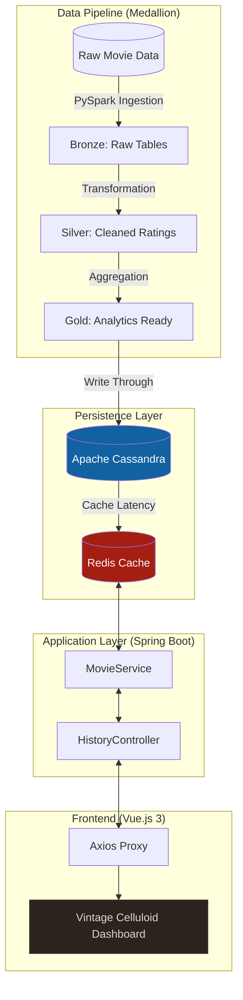

# FlexStream: Real-Time Movie Analytics Dashboard

A high-performance movie rating dashboard utilizing a **Medallion Architecture** (Bronze/Silver/Gold) data pipeline and a vintage-themed Vue.js frontend.

## 🏗️ High-Level Design (HLD)

## 🚀 Tech Stack
* **Frontend**: Vue.js 3 (Composition API), Vite, Axios
* **Backend**: Spring Boot 3, Java 21
* **Data Layer**: Apache Cassandra (Permanent Store), Redis (Caching Layer)
* **Architecture**: Hexagonal / Ports & Adapters

## 🏃 How to Run
1. **Containers**: `docker-compose up -d`
2. **Backend**: `mvn spring-boot:run`
3. **Frontend**: `cd flexstream-frontend && npm install && npm run dev`

## 🎨 UI Design
Features a cinematic "Vintage Celluloid" theme with dynamic film-strip borders and real-time movie filtering.
